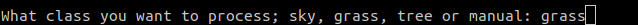

# Using CVAT for semantic segmentation annotations.
The following installation commands might be outdated. Please follow this [CVAT repo](https://github.com/opencv/cvat) to have the most up to date installation instructions.
Assuming you are running on a debian-based linux distro OS, preferably UBUNTU >= 18.04.
### Install Docker and Docker Compose

```
sudo apt-get update
sudo apt-get --no-install-recommends install -y \
apt-transport-https \
ca-certificates \
curl \
gnupg-agent \
software-properties-common
curl -fsSL https://download.docker.com/linux/ubuntu/gpg | sudo apt-key add -
sudo add-apt-repository \
"deb [arch=amd64] https://download.docker.com/linux/ubuntu \
$(lsb_release -cs) \
stable"
sudo apt-get update
sudo apt-get --no-install-recommends install -y \
docker-ce docker-ce-cli containerd.io docker-compose-plugin
```

post installation steps:

```
sudo groupadd docker
sudo usermod -aG docker $USER
```

### Clone CVAT

```
git clone https://github.com/opencv/cvat
cd cvat
export CVAT_HOST=your-ip-address
```
With the following command, you will be asked to enter a username and a password.
```
docker exec -it cvat_server bash -ic 'python3 ~/manage.py createsuperuser'
```


### Install google Chrome 

```
curl https://dl-ssl.google.com/linux/linux_signing_key.pub | sudo apt-key add -
sudo sh -c 'echo "deb [arch=amd64] http://dl.google.com/linux/chrome/deb/ stable main" >> /etc/apt/sources.list.d/google-chrome.list'
sudo apt-get update
sudo apt-get --no-install-recommends install -y google-chrome-stable
```

### Run cvat as a docker container

```
sudo docker compose -f docker-compose.yml -f docker-compose.dev.yml -f components/serverless/docker-compose.serverless.yml up -d --build
```
the `--build` flag can be ommited after first time use but should be put inside the command if a major change has been installed.

open Google Chrome and go to `localhost:8080`. You will be asked to enter you previously defined username and password to enter into cvat local dashboard.


### Deploy a DL model to assist annotation (semi-automatic and automatic annoations)

In CVAT all such DL models are implemented as serverless functions using the Nuclio serverless platform. 
You first have to install nuctl command line tool to build and deploy serverless functions.
Download [version.1.8.14](https://github.com/nuclio/nuclio/releases/tag/1.8.14). 
Then:

```
sudo chmod +x nuctl-<version>-linux-amd64
sudo ln -sf $(pwd)/nuctl-<version>-linux-amd64 /usr/local/bin/nuctl
```

At the root of cvat repo:

```
serverless/deploy_cpu.sh serverless/pytorch/facebookresearch/sam/
```

wait until the model has been succesfully been built. You can see its status on a web UI by entering `localhost:8070` in Google Chrome.

# Post Processing 

If the annotation using cvat lacks accuracy at the boundaries, one can uses `scripts/post_processing.py` to improve the annotations by manually annotate the image based on color gradient.

First you need to set the [path](http://192.168.1.92/ylegars/semantic_seg_annotations/-/blob/master/scripts/post_processing.py#L11) to where your sequence is located inside your computer.

You can run the script with the next command:
 ```
 python3 post_processing.py
 ```

 You will be asked which sequence you want to process, followed by what index inside the image folder you want to start at.

 By pressing by `l`, you go to the next image in the image folder. 
 By pressing `a`, you go the previous image.
 By pressing `s`, you will be asked which class you would like to annotate. 



If you choose one of the classes, a HSV trackbar will appear. You can set the range of each HSV values by sliding the trackbars while maintaining `g` to visualize the effect of the threshold on the segmentation. Once satisfied, press `s`.


Some classes share the same color, so you will need to remove unwanted pixels by drawing bounding boxes around areas to remove light pixels.
if you make a mistake, you turn the mousewheel backward to revert the last action.


Once you removed any unwanted pixels not belonging to the desired class, you can press `s` which will display the original mask and the new mask.
You can fill in the void with the desired class. You will set the right color by double clicking with the middle button of the mouse on the color of you choice and then you start drawing rectangle on regions to fill in the void as shown in the following gif.


If you make a mistake, you can revert the last change by moving the mousewheel backward. 
If you press `s`, the processed mask will be saved in a `mask` directory. You can press `c` by continuing processing another class on the same image.
By pressing `l` or `a`, you go to the next image. 

If you type manual instead of a class, the saved processed mask will be display and you can make some change by changing/swapping color. You double click with the middle button on an desired color to be added and you double click again on a color that needs to be replaced as shown in the following gif:

